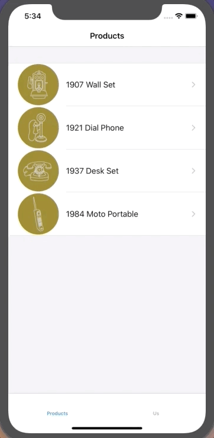

GoodAsOldPhones
==========

GoodAsOldPhones is the demo app of [Swift tutorial](https://www.codeschool.com/courses/app-evolution-with-swift) on code school. This app demonstates basic use and implementation of tab bar controller, navigation controller, scoll view, table view and storyboard.

## Screenshots

## 知识点

- UINavigationController
- UITabBarController
- UITableView
- UIScrollView  等基本控件的简单应用
- 所有的控件使用懒加载初始化，保持统一，便于阅读