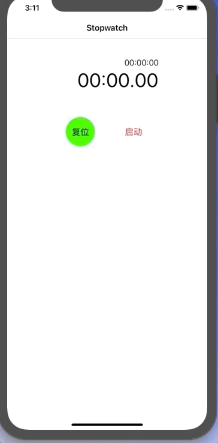

Stopwatch
==========

Stopwatch is a Swift App that measures amount of time elapsed from a particular time. It highly mocks the stopwatch of Apple's offical App called Clock. This app supports functions such as lap record, time resume, and stopwatch reset.

## Screenshots



## 知识点

- .swift 文件的页面排版，便于阅读和维护代码

  ```swift
  // MARK:    ---     Variables
  // MARK:    ---     UI components
  // MARK:    ---     Lifecycle
  // MARK:    ---     OverwriteSuperClass
  // MARK:    ---     Response Mehtods
  // MARK:    ---     Delegate
  // MARK:    ---     Private Methods
  // MARK:    ---     Public Methods
  // MARK:    ---     Extension
  ```

  

- Timer 计时器的基本使用

- .语法糖的使用，简直爆炸无敌香

- SnapKit 第三方的基本使用，实在是不想算frame了 

  

