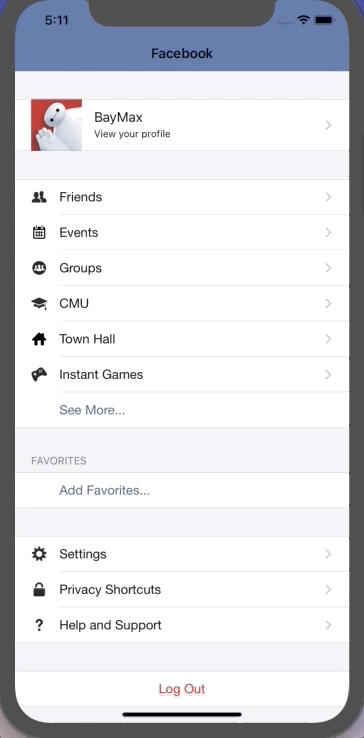

FacebookMe
==========
FacebookMe is a Swift App Mimics the personal profile tab of Facebook. It demos one simple way to implement a UITableView with mutiple sections and different types of cells.

## Screenshots

## 知识点

- UITableView多区间的简单使用
- struck 的简单使用
- as关键字的简单使用
- convenience 关键字的简单使用