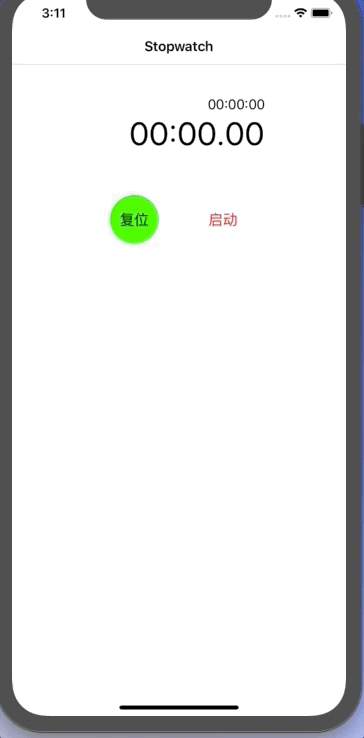

# 30-Swift-Projects

都9102了，还不学一下Swift，砖还能不能好好搬了！！！

感谢大佬 [故胤道长](http://weibo.com/soapyigu) 的开源 **[Swift-30-Projects](https://github.com/soapyigu/Swift-30-Projects)** 项目，膜拜~

本主要是为了督促自我学习，并记录相关知识点。侵权请告知，立即删除~

所有的项目均采用纯代码的形式写， 大佬的项目是混合的。

使用 swift 5.0 构建项目，所有项目的示意图如下：


- [30-Swift-Projects](#30-swift-projects)
  * [01. GoodAsOldPhones](#01-goodasoldphones)
    + [Screenshots](#screenshots)
    + [知识点](#知识点)
  * [02. Stopwatch](#02-stopwatch)
    + [Screenshots](#screenshots-1)
    + [知识点](#知识点-1)

------

## 01. GoodAsOldPhones

GoodAsOldPhones is the demo app of [Swift tutorial](https://www.codeschool.com/courses/app-evolution-with-swift) on code school. This app demonstates basic use and implementation of tab bar controller, navigation controller, scoll view, table view and storyboard.

### Screenshots


### 知识点

- UINavigationController
- UITabBarController
- UITableView
- UIScrollView  等基本控件的简单应用
- 所有的控件使用懒加载初始化，保持统一，便于阅读

## 02. Stopwatch

Stopwatch is a Swift App that measures amount of time elapsed from a particular time. It highly mocks the stopwatch of Apple's offical App called Clock. This app supports functions such as lap record, time resume, and stopwatch reset.

### Screenshots



### 知识点

- .swift 文件的页面排版，便于阅读和维护代码

  ```swift
  // MARK:    ---     Variables
  // MARK:    ---     UI components
  // MARK:    ---     Lifecycle
  // MARK:    ---     OverwriteSuperClass
  // MARK:    ---     Response Mehtods
  // MARK:    ---     Delegate
  // MARK:    ---     Private Methods
  // MARK:    ---     Public Methods
  // MARK:    ---     Extension
  ```

  

- Timer 计时器的基本使用

- .语法糖的使用，简直爆炸无敌香

- SnapKit 第三方的基本使用，实在是不想算frame了 

  

