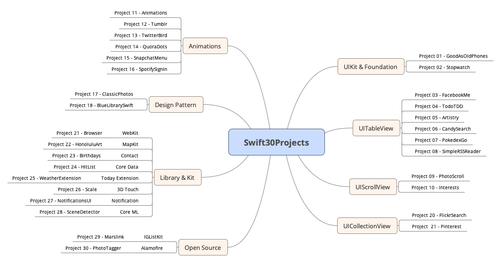

# 30-Swift-Projects

都9102了，还不学一下Swift，砖还能不能好好搬了！！！

感谢大佬 [故胤道长](http://weibo.com/soapyigu) 的开源 **[Swift-30-Projects](https://github.com/soapyigu/Swift-30-Projects)** 项目，膜拜~

使用 swift 5.0 构建项目，所有项目的示意图如下：

本主要是为了督促自我学习，并记录相关知识点。

